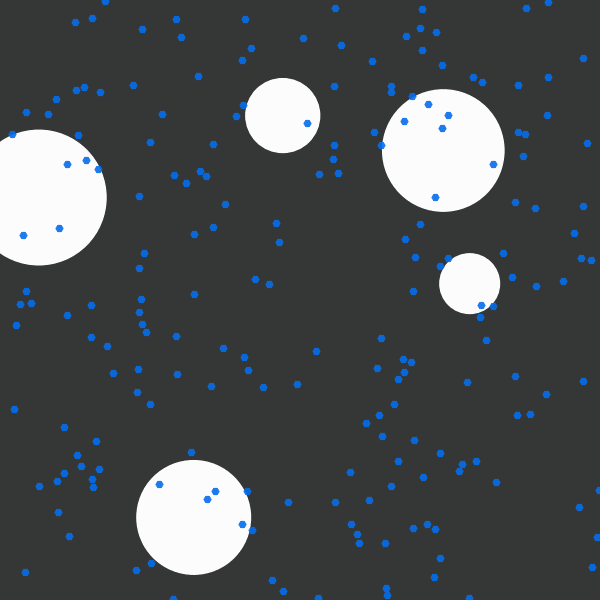

# A JAX implementation of the Boids model

This is a port of Google's Colab notebook for the boids model. Their implementation was to demonstrate the utility of [JAX](https://github.com/google/jax) as a library for speeding up the dynamics of the model by allowing JAX to vectorise individual boids dynamics across a large population.

While JAX is mostly used to provide auto-differentiation for Machine Learning research, JAX also brings [XLA](https://www.tensorflow.org/xla) to the toolbox:
> What’s new is that JAX uses XLA to compile and run your NumPy programs on GPUs and TPUs. Compilation happens under the hood by default, with library calls getting just-in-time compiled and executed. But JAX also lets you just-in-time compile your own Python functions into XLA-optimized kernels using a one-function API, jit. Compilation and automatic differentiation can be composed arbitrarily, so you can express sophisticated algorithms and get maximal performance without leaving Python. You can even program multiple GPUs or TPU cores at once using pmap, and differentiate through the whole thing.

## Progress

So far, the model seems to run well (even using the CPU-only version of JAX available for M1 Macs). The rendering for this notebook simply uses matplotlib's animation function to produce HTML videos that display inline in the notebook. Google's colab output used WebGL but this did not render offline for me, so I have done my best to faithfully recreate the output from Google's notebook in this non-Colab notebook.

### Requirements
- JAX and JAX M.D. (molecular dynamics)
  - Ex. installation for M1 Macs:
  - > pip install "jax[cpu]" jaxlib jax_md
- ffmpeg and pillow for mp4 and gif output, respectively
- The usual libraries:
  - numpy, matplotlib, seaborn, ...